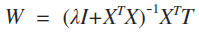

## SVM实验报告

### Task1  
使用基于某种核函数(线性，多项式或高斯核函数)的 SVM 解决非线性可分的二分类问题，实验中主要使用了线性核函数和高斯核函数。 主要利用 SMO 算法实现 SVM，简介如下：
SVM模型的主要目的是最大化分类间隔，即：

	 

 
对上式使用拉格朗日乘子法得到其“对偶问题”，即：

	 

 
解出 *α* 后，即可求出 *ω* 与 *b* ：

	 

 
SMO 的基本思路是先固定 *α*i 之外的所有参数，然后求 *α*i上的极值 。由于存在约束 *∑*mi=1 *α*i*y*i = 0，若固定 *α*i 之外的其他变量, 则*α*i 可由其他变量导出。于是， SMO 每次选择两个变量 *α*i和 *α*j ，并固定其他参数。这样，在参数初始化
后， SMO 不断执行如下两个步骤直至收敛:  

* 选取一对需更新的变量 *α*i 和 *α*j
* 固定 *α*i 和 *α*j以外的参数，求“对偶问题”解析式获得更新后的参数值  

具体代码可见[svm.py](src/svm.py)  
实验中，首先可视化实验数据：  

	 

 
可以看到实验数数据包含两类，且并非线性可分。
#### linear_kernel  
线性核函数定义如下：

	 

 
取参数C为1.0（C>0,控制了松弛变量惩罚与边缘之间的折衷），实验效果如下：

	 

 
训练集上得到的准确率为81.0%，测试集上得到的准确率为81.0%。可以看到对于非线性可分的二分类问题，采用线性核并没有得到很好的分类效果。模型试图用线性平面来取边界，显然这对于非线性分类问题来说，会导致边界附近很多正样本和负样本分类错误。
#### gaussian_kernel
高斯核函数定义如下：

	 

 
高斯核函数很好的刻画了两个样本之间的相似性，如果样本相近，则核函数计算得到的结果趋近于0，否则计算结果较大。实验中取C为1.0，sigma为0.1，得到以下效果：

	 

 
训练集上准确率为100.0%，测试集上准确率为94.5%，可以看到对于非线性分类问题，高斯核的分类效果好于线性核。
### Task2 
使用线性分类器、logistic回归以及SVM解决线性二分类问题，并比较三种模型的效果。首先可视化数据：  

	 

 
#### svm  
实验中设置参数C为1.0，采用线性核，得到的效果如下：

	 

  
训练集上的准确率为95.5%，误差为0.09，测试集上的准确率为96.5%。其中SVM采用以下误差函数：  

	 

  
#### logistic  
logistic线性回归中，采用梯度下降方法求解分界线参数，相关推导公式如下：

	 

根据上式通过对似然函数取负对数构造误差函数并且加上正则化项：

	 

 
根据误差函数可以推导出梯度下降时，***W*** 的迭代公式为：    

	 

  
实际训练时，设置学习速率为0.01，正则化参数为1，迭代1000次，最终效果如下：

	 

 
训练集上准确率为95.5%，误差为：0.099，测试集上准确率为96.5%。
#### linear  
线性分类器的实现主要参考了课本4.1.3节——用于分类的最小平方方法。使用该方法，第一步需要将标签`t_train`改为 one-hot 向量。比如：[1] --> [1,0] , [-1] --> [0,1]。可以推导出参数 ***W*** 的求解公式为：  

	 

   
误差函数定义如下：  

	 

   
实验中设置正则化参数为1，得到的分类效果如下：  

	 

  
训练集上准确率为96.0%，误差为0.1173，测试集上的准确率为98.0%。 

#### 对比分析
可以看到基于实验中的训练样本，以上三种方法都可以做到很好的分类效果（准确率均在百分之96以上）。误差上，三种方法得到的误差相近，差别主要由每种方法计算误差方式不同导致。但用于分类的最小平方方法对于异常点较为敏感，在很多情况下并不适合用来进行分类。logistic回归和svm在分类上效果较好。
### Task3  
利用SVM解决多分类问题，实验数据可视化如下：  

	 

可以看到有三个类别，采用“一对剩余”（one-versus-the-rest）方法来进行分类。具体来讲，构建3个独立的SVM，其中第 k 个模型 yk(x) 在训练时，使用来自类别 Ck 的数据作为正例，使用剩余的2个类别得数据作为负例。而在对于新输入的 x ，采用以下方式进行判断：  

	 

  
实验中设置SVM模型参数 C=1.0，并且采用线性核，三个svm的效果如下：  
#### svm1
将 t = 1 的样本作为正例：  

	

   
训练集上准确率为：98.7%。
#### svm2
将 t = -1 的样本作为正例：

	 

训练集上的准确率为：98.0%
#### svm3
将 t = 0 的样本作为正例：  

	 

   
训练集上的准确率为：97.7%。  
最终利用 “one-versus-all“ 在训练集上测得的准确率为98.3%，测试集上的准确率为98.7%。

### 参考文献
1. [《机器学习》周志华 清华大学出版社](https://book.douban.com/subject/26708119/)