## 高斯混合模型（GMM）聚类
### 原理简介
高斯混合模型是一种概率式的聚类方法，它假定所有的数据样本 *x* 由 *k* 个混合多元高斯分布组合成的混合分布生成：  

	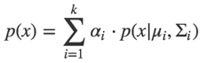

其中*p*(*x* | *μ*,Σ)为服从高斯分布的 *n* 维随机向量 *x* 的概率密度函数:

	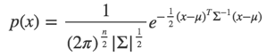

第一个公式中 *μ* 是 *n* 维均值向量，*Σ* 是 *n×n* 的协方差矩阵，而 αi>0 为相应的“混合系数”(mixture coefficient), *∑*ki=1 *α*i = 1。  

GMM聚类的过程是利用GMM生成数据样本的“逆过程”：给定聚类簇数 *k* ，通过给定的数据集，以某一种参数估计的方法，推导出每一个混合成分的参数均值向量 *μ* ,协方差矩阵 *Σ* 和混合系数 *α* 。每一个多元高斯分布成分即对应于聚类后的一个簇。高斯混合模型在训练时使用了极大似然估计法，最大化以下对数似然函数：

	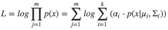

采用EM算法进行迭代优化求解，简单的推导如下：  
若参数 {(*α*i,*μ*i,*Σ*i) | (1 ≤ i ≤ k)} 能使上式最大化，则由 ∂*L*／∂*μ*i = 0有:  

	

令：

	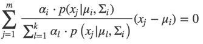

可知它表示了样本 *x*j 由第 *i* 个混合成分生成的后验概率，因此可以得到：

	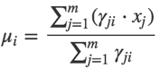

即各混合成分的均值可通过样本加权平均来估计，样本权重是每个样本属于该成分的后验概率。同样对于 *Σ*i，我们可以得到：  

	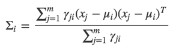

对于混合系数 *α*i 除了要最大化L式，还需要满足 *α*i ≥ 0,*∑*ki=1 αi = 1，考虑L的拉格朗日形式：

	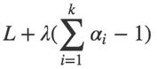

其中 *λ* 为拉格朗日乘子，上式对 *α*i 的导数为0，有：

	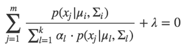

两边同时乘以 *α* i，对所有样本求和可知 *λ* = −*m*,有：

	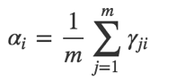

### 算法简介  
根据以上原理，可以归纳GMM算法如下（参考[机器学习 周志华 9.4.3](https://book.douban.com/subject/26708119/)）：

	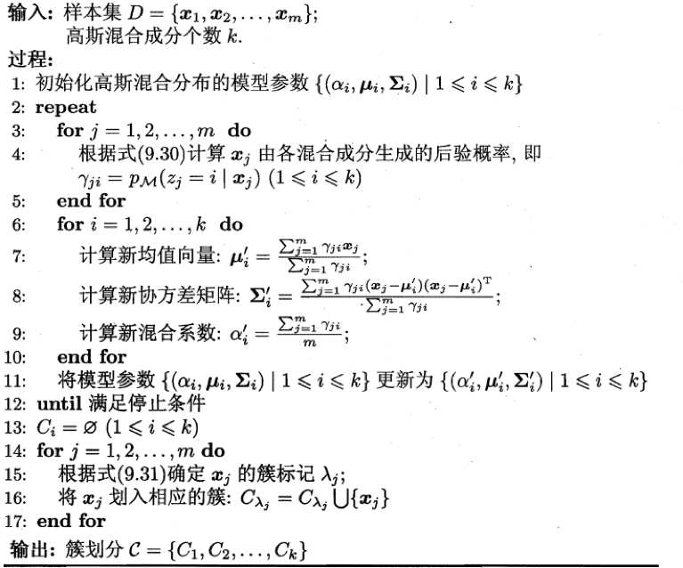

具体实现代码可查看[utils.py](./utils.py)。 

### 实验过程
实验中主要包含两步：数据生成，模型测试。以下是具体介绍：
#### 数据生成
数据生成主要利用了[numpy.random.multivariate_normal()](https://docs.scipy.org/doc/numpy-1.14.0/reference/generated/numpy.random.multivariate_normal.html)，输入均值向量、协方差矩阵、数据个数，即可得到实验数据：  

	def generate_data(mu,sigma,K=3,num=50):
	    '''
	    generate dataw which object to gaussian distribution
	    '''
	    X1 = []
	    X2 = []
	    for i in range(K):
	        x1,x2 = np.random.multivariate_normal(mu[i],sigma[i],num).T
	        X1.append(x1)
	        X2.append(x2)
	        plt.plot(x1,x2,MARKER_COLOR[i],markersize=5)
	    plt.show()
	    return X1,X2
 
 实验中设置生成3类数据，每个种类50组数据，分布如下：  
 

	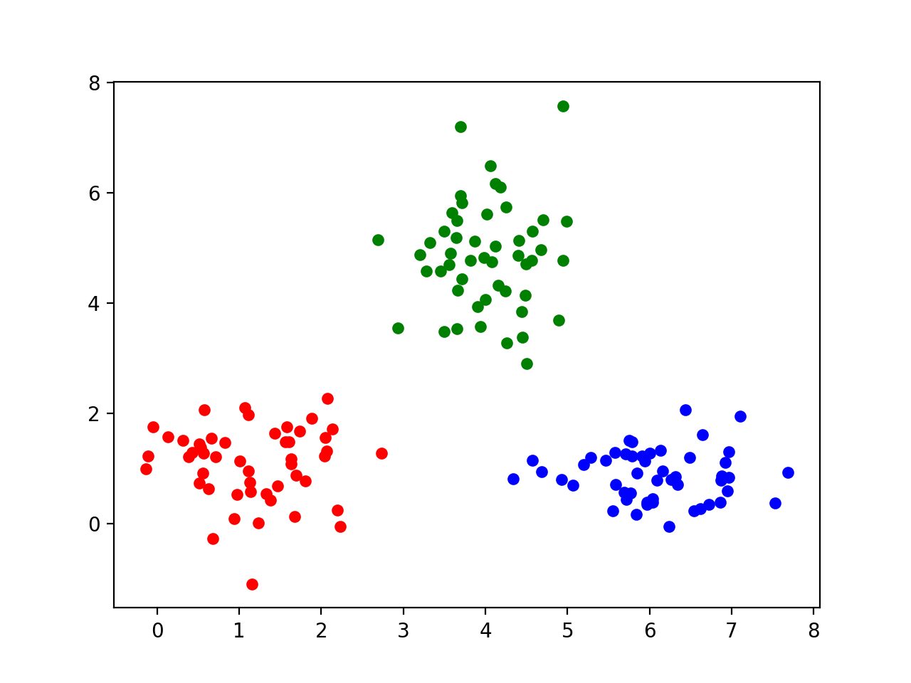

实验数据保存在[data](./data.txt)。如果测试新的数据，可以执行[main.py](./main.py) 中 `run()` 函数，并输入参数 `u`、 `sigma` 以及`K`,如下所示：  

	mu1 = [1.0,1.0]
   	sigma1 = [[0.5,0.0],[0.0,0.5]]
   	mu2 = [4.0,5.0]
   	sigma2 = [[0.4,0.0],[0.0,0.8]]
   	mu3 = [6.0,1.0]
   	sigma3 = [[0.6,0.0],[0.0,0.3]]
   	mu = [mu1,mu2,mu3];sigma = [sigma1,sigma2,sigma3]
   	## function
   	run(generate_new_data=True,mu=mu,sigma=sigma,K=K,num=50)
#### 模型测试 
对以上数据执行高斯混合聚类算法，分别进行不同的迭代周期，效果如下：  
maxIter = 1: 

	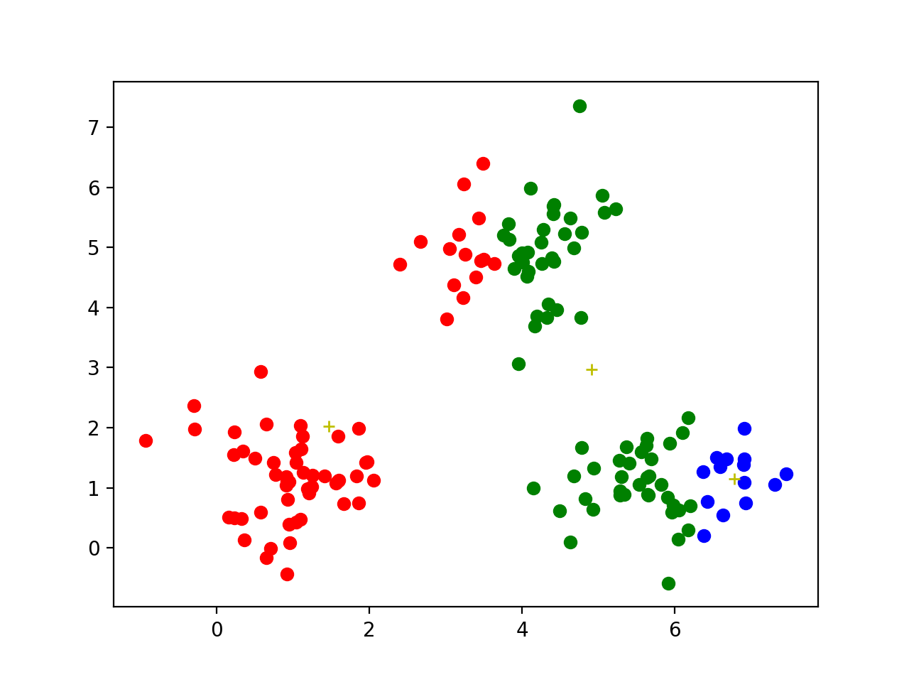

可以看到第一类数据点有65个，第二类数据点有71个，而第三类数据点只有14个。  
maxIter = 2:  

	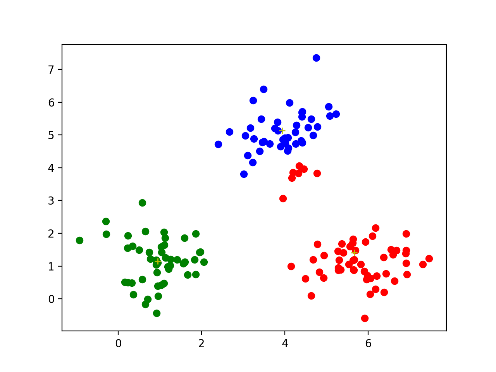

可以看到这时聚类效果已经较为不错，只有第三类少部分点被分到第二类中。  
numIter = 3:

	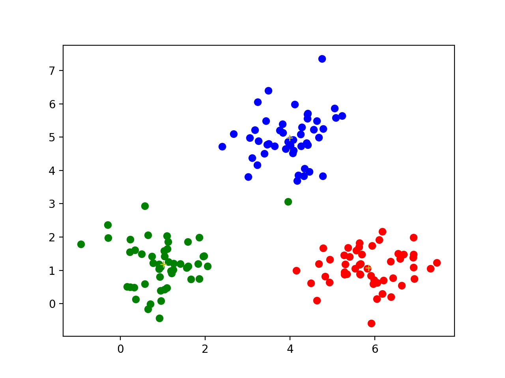

numIter = 4:

	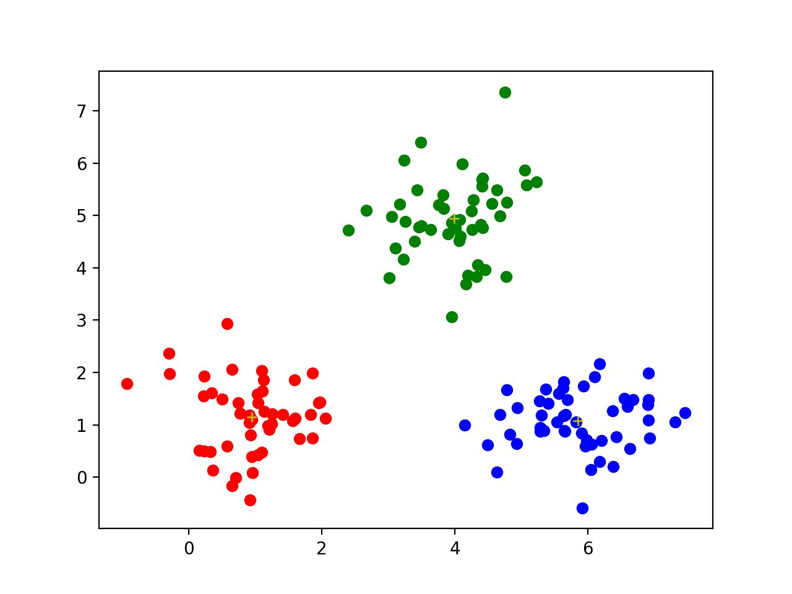

迭代四个周期，可以看见数据点已经正确聚类。因为实验数据分布差别较为清晰，四个迭代周期便可以得到很好的聚类效果。

### 参考文献  
1. [《机器学习》](https://book.douban.com/subject/26708119/)周志华， 清华大学出版社   
2. [原型聚类之高斯混合聚类](https://blog.csdn.net/faiculty/article/details/79343640)