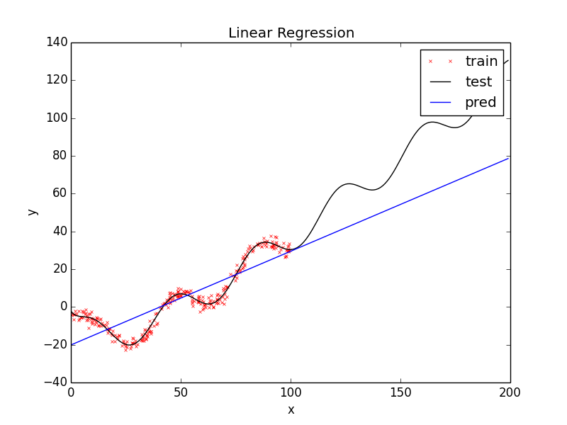
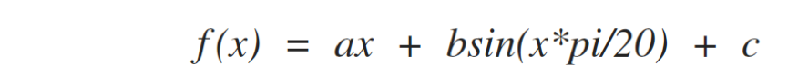
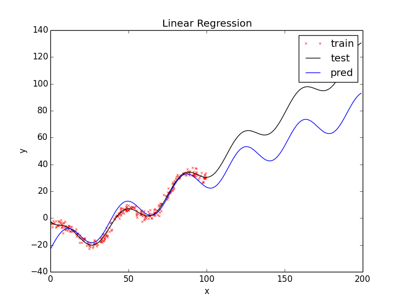
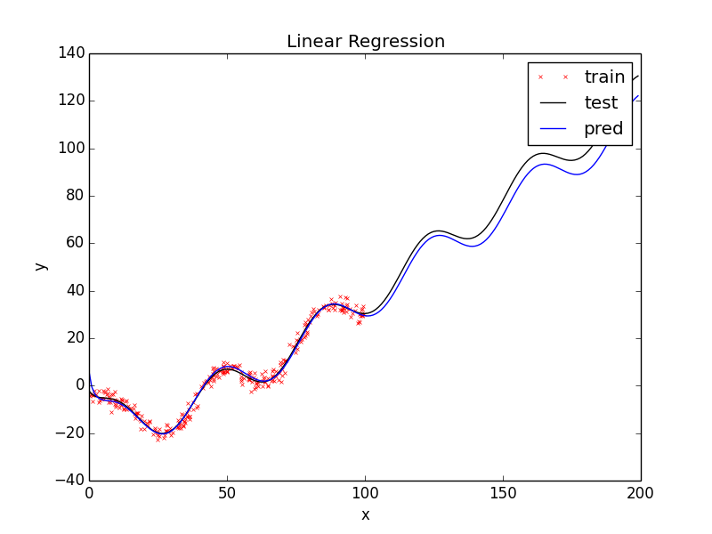
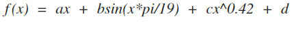

## 线性回归  
### 实验思路
线性回归的目的是构建合适的函数模型，输入 **X** ，通过模型得到 **f(X)**，使得 **|Y-f(X)|** 尽量小。基于此目的，解决思路如下：  
  
  1. 构建函数模型 **f(W)**，以及损失函数  **cost(W)**
  2. 通过训练集得到使损失函数值最小的参数 **W**  
  3. 将函数模型运用在测试集上，计算标准差 **Sigma**  
  4. 调整函数模型，重复 2-4，得到 **Sigma** 最小的函数模型  
  
### 实验过程 
#### 直线拟合 
训练集上 **X** 为一维的，最简单的拟合方式便是直线拟合。通过直线拟合可以观察构建的函数模型比实际函数模型缺少哪些特征，以便进一步改进。  

   
 
直线拟合在测试集上得到标准差为：20.7
#### 三角拟合  
通过上图可以发现，实际函数模型的极小值以及极大值具有周期性。显然简单的直线模型不具有这一特质，联想到三角函数的周期性，可以在直线的基础上，给模型添加三角函数 **sin(wX)**。另外注意到相邻极小值以及相邻极大值之间的水平距离大致为40，因此初步确定 **w** 为 **pi/20**。函数模型为：  
 
  

拟合结果如下：  
  
  

可以看到拟合的函数曲线极小值以及极大值有了周期性，但周期并不是完全一致。接着调整 **w** 的值得到以下结果：  
  
|w        | sigma  |w       | sigma  |
|:------: |:------:|:------:|:------:|
|40.0     | 19.6   |30.0    |20.2    |
|20.0     |21.3    |10.0    |20.3    |
|18.0     |16.0    |19.0    | 17.7   |
可以看到 **w** 在10-20之间时，测试集上得到的标准差相近，均在16.0-20.0 之间。从标准差上看，和单纯用直线模拟，加入三角函数特征并没有很大地改善模型能力。但加入三角特征主要是为了拟合极小值、极大值的周期性，通过观察拟合曲线发现，最好的情况在 **w=19.0** 时取得。  

#### 偏差修补  
通过前两部，拟合曲线的基本走势和实际函数曲线一致，但在 **x > 100** 的区间上，拟合曲线明显低于实际函数曲线，这时考虑为函数模型添加增长趋势小于 **y=x** 的函数，比如 **log(x+1)**，拟合效果如下：  

  

方差为4.1。可以看到拟合效果较为不错，但注意到 在 **x > 100**的区间上，拟合曲线增长趋势小于实际函数曲线，说明 **log(x+1)**  的增长速率不够。考虑用 **x^p (p < 1)** 来代替  **log(x+1)** 具体效果如下表所示:  

|   p    | sigma  | p      | sigma  |
|:------:|:------:|:------:|:------:|
|0.5     |   1.6  |0.4     |   1.2  |
|0.3     |   2.3  |0.45    |   1.2  |
|0.42    |   1.1  |0.38    |   1.3  |  
最好的模型来自于 **p=0.42** 时，此时标准差为 1.1， 拟合效果如下：  

  

因此最终的函数模型为:  

   
 
其中：
W = [a,b,c,d] = [1.19, 8.25, -13.00, 7.84]
