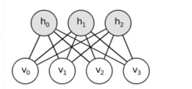
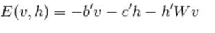
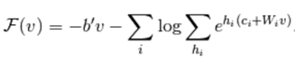
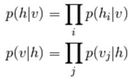
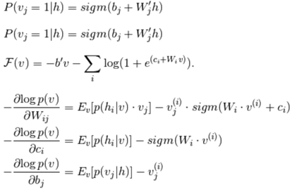
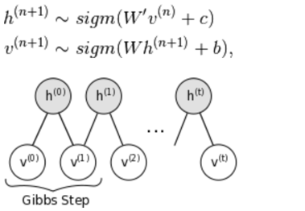
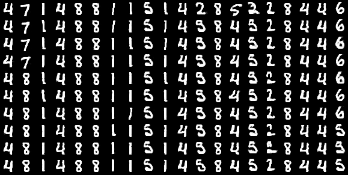

## 受限玻尔兹曼机(RBM)实验报告
### 一、原理简介
#### 1、受限玻尔兹曼机  
玻尔兹曼机（BM) 是马可夫随机场（MRF)的一种特殊形式，即在自由参数中能量函数呈线性。为使他们能表达复杂分布（即从有限的参数设置到非参），考虑一些变量始终未被观察到（隐藏）。通过有更多隐藏变量（隐藏单元）我们可以提升玻尔兹曼机的建模能力。受限玻尔兹曼机更进一步，去除了可见与可见，隐藏与隐藏之间的连接，图示如下:

其中，能量函数 *E*(*h,v*) 定义如下：

*W* 是连接隐藏和可见层的权重，*b*, *c* 分别是可见和隐藏层的偏置。自由能量公式为：

因为RBM的特殊结构，可见和隐藏单元有条件的相互独立，因此有：

使用二分单元更新公式，得到下列指数相似梯度：

#### 2、受限玻尔兹曼取样
*p*(*x*) 的样本可以通过运行马可夫链直到聚合获得，使用吉布斯取样作为过渡。
对于受限玻尔兹曼机来说，S 由可见和隐藏单元组成。但是由于他们有条件独立，可以使用块吉布斯取样。在这里，给定隐藏单元值固定，可见单元同时取样。同样，给定可见单元，隐藏单元同时取样。如下所示：

理论上，学习过程中每一个参数更新要求运行这一链直到聚合。但这样做代价太高，为了在学习过程中更有效的取样，通常采用以下两种算法：
  
* **对比发散(CD-k):**  
对比发散使用两个技巧来加快取样过程：  
既然希望 *p*(*v*) ≈ *p**train*(*v*)（数据的实际分布），可以使用训练样本来初始化马可夫链（从接近 *p* 的分布，这样该链已然接近聚合到最终分布 *p*）。  
CD不等链聚合，只在 *k* 步吉布斯取样后取样。实践中，*k*=1出人意料的有效。
* **持续CD(PCD):**  
持续CD使用另一种估算取样，它依赖于单个马可夫链，具有持续状态（不会为每一个观察到的样本重启）。对每一个参数更新，我们简单运行 *k* 步来提取新样本，链状态为后续更新保留。  

### 二、具体实现 
具体实现代码可见[rbm.py](rbm.py),实现时构造一个RBM类，网络参数主要包括：

  

|参数       |含义 |
|:--------:|:------:|
|n_visible |可见层节点|
|n_hidden  |隐藏层节点|
|W   | 权重矩阵|
|vbias|可见层偏置|
|hbias|隐藏层偏置|

具体训练时，由于可见层节点数目固定（784=28*28），因此主要调节隐藏层节点数目，进而改变网络结构。  
  
下面对 RBM类的部分函数进行解释：
#### `propup(self,vis)`
网络正向传播，输入为可见层样本值。
#### `sample_h_given_v(self, v0_sample)`
给定可见层输入，得到隐藏层输出以及相应采样样本。
#### `propdown(self,hid)`
和`propup()`对应，网络反向传播，输入为隐藏样本值。
#### `sample_v_given_h(self,h0_sample)`
和`sample_h_given_v()`对应，给定隐藏层输入，得到可见层输出以及相应采样样本。  

通过上面几个函数，可以定义 Gibbs 采样，定义下面两个函数：
#### `gibbs_vhv(self, v0_sample)` 
从可见单元中进行单步 Gibbs 取样。
#### `gibbs_hvh(self, h0_sample)`
从隐藏单元中进行单步 Gibbs 取样。

此外还有以下函数：
#### `free_energy(self,v_sample)`
计算模型的自由能量，用来计算参数的梯度。
#### `get_cost_updates(self,lr=0.1,persistent=None, k=1)`
生成CD-k和PCD-k的象征梯度。`get_cost_updates`接受 persistent 声明变量。因此可以使用相同代码来执行 CD 和 PCD 。使用 PCD 时， persistent 指代共享变量，包含了此前迭代的吉布斯链状态。如果persistent 是 None ，我们使用正数阶段生成的隐藏样本来初始化 Gibbs链。一旦我们建立了链的起点，我们可以计算 Gibbs 链终点的样本，我们需要该样本来计算梯度。

### 三、实验过程
#### 训练
数据集中有60000个样本，实验中用50000个样本进行训练RBM网络参数，另外10000个样本作为测试样本采样使用。  
训练时使用 PCD ，因为它展示了更好的生成模型，主要调节的网络参数为 n_hidden, 即隐藏节点个数。学习率为 0.1 , 训练 15 轮，每一轮batch大小为 20 ，结果如下：  

  

|n_hidden       |cost | time(min)|
|:--------:|:------:|:-----:|
|200|-67.85|16.50|
|300|-63.35|20.85|
|400|-59.70|23.73|
|500|-57.35|27.71|
|600|-56.50|28.81|
|700|-55.05|34.26|

实验中发现，隐藏节点数大于500之后，模型代价减少很小，在 -55.0～-57.0 之间，趋于稳定。  
此外实验中也尝试调节 k 的值以及学习率，对结果影响不大，在此不做详细说明。
#### 采样
训练完RBM之后，我们可以使用`gibbs_vhv()`来实现取样所需的 Gibbs 链。从测试样本（1000）开始初始化 Gibbs 链,以提高聚合速度和避免随机初始化的问题。  
建立20个并行的持续链来获得样本。编译一个Theano函数来执行 Gibbs 步骤并用新的可见样本来更新持续链的状态。迭代一个较大步数该函数，并在每1000步图形化样本。
结果如下：  

 
每一行代表负分子的微批次（来自 Gibbs 链的独立样本），两行间执行1000步 Gibbs 取样。

